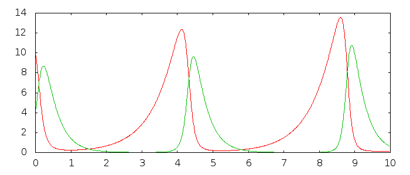

SIMPLE INTEGRATOR
=================

There are many integrators in the world. Many of the emphasise accuracy and use
high-order methods to estimate and minimize error. This kind of accuracy is
expensive. For systems that are generally well-behaved where the goal is
understanding of dynamics, rather than exact predictions, accuracy is no longer
paramount.

This C++11 library implements a simple adaptive step-size integrator based on
Euler's method. The method is both fast and simple, allowing for the quick
simulation of many-dimensional systems.

Additionally, a special class is provided which allows for discrete-time events
which instantaneously alter the state of a system. The integrator approaches
such events cautiously, using an exponentially-decreasing step-size. It
withdraws with equally caution.

The file **integrator.hpp** implements the integrator.

Examples
========

Two examples of the integrator in action are provided.

The first example **example\_lotka.cpp** simulates a Lotka-Volterra
predator-prey model.

The second example **example\_lotka\_events.cpp** simulates a Lotka-Volterra
predator-prey model with discrete events. Here one of the discrete events is a
sudden single large drought which reduces one of the species' populations to
about one-third of its pre-drought size. The other event is a smaller drought
which reduces the same population to half its pre-drought size every 3 years
beginning on the 4th year of the simulation.

![Lotka-Volterra predator-prey model output with discrete events]
(readme_imgs/lotka_events.png)

Building
========

To build, run

    make

and **Makefile** will be run. Or compile with a C++11 compiler.

This library is known to work with G++ 4.7.3.
